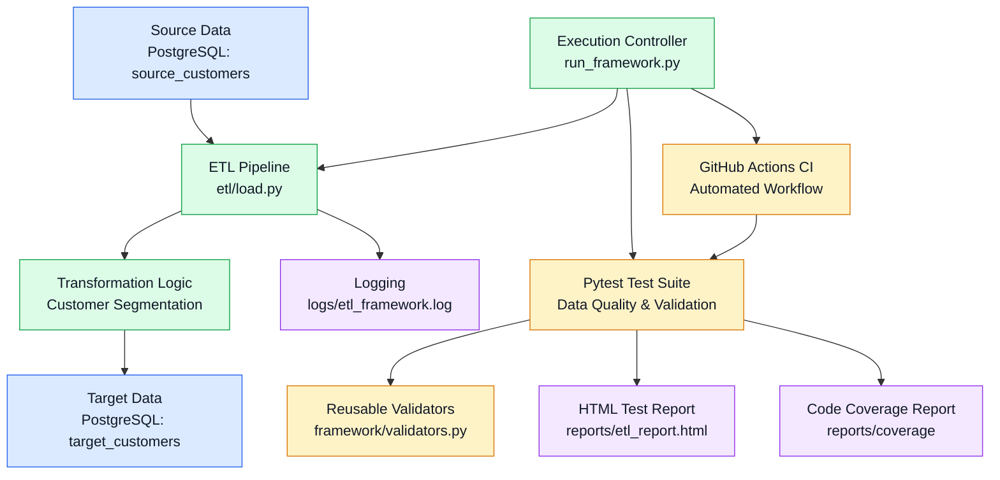

# ETL Testing Framework — Architecture

```mermaid
flowchart TD
    A["Source Data<br/>PostgreSQL: source_customers"]
    B["ETL Pipeline<br/>etl/load.py"]
    C["Transformation Logic<br/>Customer Segmentation"]
    D["Target Data<br/>PostgreSQL: target_customers"]
    E["Pytest Test Suite<br/>Data Quality & Validation"]
    F["Reusable Validators<br/>framework/validators.py"]
    G["Execution Controller<br/>run_framework.py"]
    H["HTML Test Report<br/>reports/etl_report.html"]
    I["Code Coverage Report<br/>reports/coverage"]
    J["Logging<br/>logs/etl_framework.log"]
    K["GitHub Actions CI<br/>Automated Workflow"]

    A --> B
    B --> C
    C --> D
    G --> B
    G --> E
    E --> F
    E --> H
    E --> I
    B --> J
    G --> K
    K --> E

    classDef data fill:#dbeafe,stroke:#2563eb,color:#111827
    classDef process fill:#dcfce7,stroke:#16a34a,color:#111827
    classDef testing fill:#fef3c7,stroke:#d97706,color:#111827
    classDef reporting fill:#f3e8ff,stroke:#9333ea,color:#111827

    class A,D data
    class B,C,G process
    class E,F,K testing
    class H,I,J reporting
```
